# Hosted Auth and Team Switching

This note defines the smallest sensible move from local-only Cornerstone to an internet-facing deployment on GCP.

The goal is not to build a full enterprise identity system. The goal is to keep the current family-team product model, host it safely on the public internet, and avoid forcing small children to manage their own credentials.

## Current Baseline

Today Cornerstone is still using a local-first identity shape:

- `deploy/config/runtime_defaults/identity_bootstrap.yaml` seeds one team, its users, and memberships.
- both dev compose and the current production template mount the same bootstrap file and auto-apply it at startup.
- the API still trusts a lightweight viewer session and the `x-cornerstone-viewer` header to decide who is acting.

That is acceptable for local development and home-LAN use. It is not sufficient once the app is exposed at a public domain.

## Decision Summary

Use this shape first:

- Host Cornerstone on a GCP VM using the same VM-oriented compose flow you already use in the CRM repo.
- Put HTTPS and a reverse proxy in front of the stack and serve the Flutter app and API from the same public origin.
- Keep `identity_bootstrap.yaml` as seed data for teams, adults, learners, and memberships.
- Add real authentication only for adults who need privileged access.
- Do not require learners to have email addresses, passwords, or Google accounts.
- Separate the authenticated adult account from the active Cornerstone user profile.
- Use server-managed session cookies for the web app. Do not force a JWT-only design just because the API is REST-shaped.

## Recommended Identity Model

Use two layers.

### 1. Operator Account

This is the authenticated adult identity.

- signs in with Google first
- may optionally support password sign-in later
- exists for adults who can administer or support a team
- is the subject recorded in audit and security logs

### 2. Team Member Profile

This is the existing Cornerstone person record.

- owner
- parent
- teacher
- learner

Learners remain team members, not login principals.

That split is the key decision. It solves the main family requirement: an adult can authenticate once, then switch between the people in the family team without creating separate internet-facing credentials for each child.

## How Switching Should Work

The browser session should carry three pieces of state:

- `operator_account_id`: the authenticated adult
- `team_id`: the selected family team
- `active_user_id`: the current Cornerstone member profile being viewed

The normal flow is:

1. Parent signs in with Google.
2. Server resolves which team or teams that operator can access.
3. Server chooses a default active user, usually the adult's own owner or parent profile.
4. UI shows a switcher with the team members the adult is allowed to act as.
5. When the adult chooses a learner, the server updates `active_user_id` in the session.
6. Learner workspace requests render in the learner context, but the server still knows which adult authenticated the session.

That last point matters. Cornerstone should know both:

- who authenticated the browser session
- which member profile is currently active in the UI

This keeps shared-family-device switching easy without losing accountability.

```mermaid
flowchart LR
    A[Adult signs in with Google] --> B[Server creates session cookie]
    B --> C[Session stores operator_account_id]
    C --> D[Server selects default team and active_user_id]
    D --> E[UI loads switchable team members]
    E --> F[Adult switches to learner profile]
    F --> G[API serves learner workspace in active profile]
    G --> H[Audit still records authenticated adult]
```

## Authorization Rules

Keep the rules simple.

- `owner`, `parent`, and `teacher` are adult roles that can sign in through an operator account.
- `learner` is a product role, not a hosted login role.
- team-management actions stay restricted to adult roles.
- learner-facing pages may be rendered while an adult session is acting as a learner profile.
- if you later want a true learner-only kiosk mode, add it separately. Do not make that the first hosted identity model.

For the first hosted version, an authenticated adult linked to a team may switch into any learner in that same team.

## REST and Session Design

You do not need to reinvent authentication because the API is REST-based.

The simplest correct web shape is:

- same-origin frontend and API at `https://cornerstone.dhenara.com`
- HTTP-only secure session cookie
- CSRF protection on mutating requests
- server-side session lookup on each request

That is the same core idea already working in your CRM repo. The fact that the frontend is Flutter web and the backend is Rust does not change the model.

For hosted web:

- remove the public-internet dependency on `x-cornerstone-viewer`
- stop treating username selection as authentication
- resolve the viewer from the session instead of from a trusted request header

The current `ViewerSessionResponse` shape is already close to what you need. Keep the idea of:

- current user
- available users
- team summary

Change only how the server determines them.

## Recommended HTTP Surface

Follow the CRM split between auth endpoints and business endpoints.

Add an auth namespace such as:

- `GET /api/v1/auth/options`
- `GET /api/v1/auth/csrf`
- `GET /api/v1/auth/google/start`
- `GET /api/v1/auth/google/callback`
- `POST /api/v1/auth/signout`

Keep a session namespace for the active Cornerstone member context:

- `GET /api/v1/session`
- `POST /api/v1/session/active-user`

For the first hosted version, `GET /api/v1/session` should return:

- authenticated operator summary
- selected team summary
- current active member profile
- switchable member profiles
- capability flags for team management and library access

All existing business endpoints should then derive viewer permissions from the server session instead of from the viewer header.

## Data Model Changes

Keep the current team and learner tables. Add only the hosted-auth minimum.

Recommended additions:

- `operator_account`: authenticated adult identity
  - `operator_account_id`
  - `email`
  - `display_name`
  - `google_subject`
  - `is_active`
- `operator_team_link`: which team an operator may access and which adult member profile is the default
  - `operator_account_id`
  - `team_id`
  - `default_user_id`

Do not add learner credentials.

The important relationship is:

- operator account authenticates
- operator account is linked to an adult membership on a team
- adult membership may switch into learner profiles inside that team

That is enough for the first hosted rollout.

## What Bootstrap Still Does

Keep `identity_bootstrap.yaml`, but narrow its purpose.

It should remain responsible for:

- initial team seed data
- adult and learner profile seed data
- team memberships and product roles

It should not remain the hosted authentication mechanism.

In other words:

- local and dev: bootstrap can continue to support quick username-based testing
- hosted production: bootstrap creates people and memberships, while real adult sign-in controls internet access

This keeps local iteration fast without locking production into a local-only auth model.

## GCP Deployment Shape

For now, keep deployment boring.

- use the same GCP project if that reduces friction
- use a VM-oriented Docker Compose deployment like the CRM repo
- attach `cornerstone.dhenara.com` to the VM through HTTPS
- expose only the reverse proxy publicly
- keep the control-plane port private behind nginx or an equivalent proxy

Recommended first hosted shape:

- Flutter web static build served by nginx
- Rust control plane behind the same nginx instance
- Postgres on the VM or on a managed service later
- Google OAuth credentials configured for `cornerstone.dhenara.com`

Prefer same-origin hosting over cross-origin API calls. It simplifies cookies, CSRF, and browser behavior.

## Minimal Rollout Plan

### Phase 1: Host the Current Stack Safely

- deploy the existing compose stack to GCP
- terminate TLS at the reverse proxy
- serve frontend and API under one origin
- keep bootstrap seeding enabled

### Phase 2: Add Adult Authentication

- add `operator_account` and `operator_team_link`
- add Google sign-in endpoints
- create session-cookie auth for hosted mode
- allow only approved adult emails

### Phase 3: Replace Header-Based Identity in Hosted Mode

- update the Flutter app to read session state from the backend
- add active-user switching in the existing session UI
- stop trusting `x-cornerstone-viewer` for hosted requests

### Phase 4: Tighten the Hosted Path

- disable public access to the legacy username-only hosted flow
- add audit logging for `operator_account_id` plus `active_user_id`
- add password fallback only if Google-only turns out to be operationally painful

## What Not To Build Yet

Avoid these for now:

- individual learner Google accounts
- learner passwords
- a generic enterprise RBAC system
- multi-IdP abstraction
- token-based auth for every client type before the web flow is stable

Those are real future possibilities, but they are not the shortest path to a working hosted family product.

## Recommended First Decision

If you want one concrete starting point, make this the decision:

> Cornerstone hosted production will use adult-only Google sign-in plus server-managed web sessions, while learners remain team-member profiles that adults can switch into inside a family team.

That matches your family use case, fits the CRM deployment pattern you already know, and leaves room for a stricter or broader identity system later without having to rebuild the core learner model.