# Hosted Auth and Team Switching

This note defines the smallest sensible move from local-only Cornerstone to an internet-facing deployment on GCP.

The goal is not to build a full enterprise identity system. The goal is to keep the current family-team product model, host it safely on the public internet, and avoid forcing small children to manage their own credentials.

## Current Baseline

Today Cornerstone is still using a local-first identity shape:

- `deploy/config/runtime_defaults/identity_bootstrap.yaml` seeds one team, its users, and memberships
- both dev compose and the current production template mount the same bootstrap file and auto-apply it at startup
- the API still trusts a lightweight viewer session and the `x-cornerstone-viewer` header to decide who is acting

That is acceptable for local development and home-LAN use. It is not sufficient once the app is exposed at a public domain.

## Decision Summary

Use this shape first:

- host Cornerstone on a GCP VM using the same VM-oriented compose flow you already use in the CRM repo
- put HTTPS and a reverse proxy in front of the stack and serve the Flutter app and API from the same public origin
- keep `identity_bootstrap.yaml` as seed data for teams, users, and memberships
- add real hosted authentication only for owners who need privileged access
- do not require learners to have email addresses, passwords, or Google accounts
- keep one `user` model; do not introduce a separate operator-account model
- use server-managed session cookies for the web app; do not force a JWT-only design just because the API is REST-shaped

## Recommended Identity Model

Use one primary subject model plus one session concept.

### 1. User

Every real person is a `user`.

- keep one table and one API subject for people
- do not split the model into `operator`, `member`, `learner`, `teacher`, and similar parallel identity types
- a future service account can still fit under the same general subject model if needed, but that is not required for the first hosted version

Recommended user fields:

- `user_id`
- `username`
- `display_name`
- `first_name`
- `last_name`
- `email`
- `google_subject`
- `google_email`
- other small auth-supporting fields only when needed

Important rule:

- `username` is the mandatory site-wide identifier
- `email` is not the username
- if Google sign-in is used, Cornerstone may derive a starting username when needed, but the canonical product identifier remains `username`

### 2. Team Membership

Authorization stays on the team membership.

For now there are only two membership roles:

- `owner`
- `learner`

Do not add `parent`, `teacher`, `member`, or a generic role matrix yet.

### Required Fields By Membership

Do not force every user to have every auth-related field.

- every user must have a non-empty `username`
- learners do not need email, Google subject, or other hosted-login fields
- owners must have the fields required for hosted sign-in and account recovery, starting with at least:
  - `first_name`
  - `last_name`
  - `email`
- `google_subject` may be absent before first Google sign-in and then be linked on successful authentication

That keeps the product model simple while still making hosted owner access safe and explicit.

## How Switching Should Work

The browser session should carry three pieces of state:

- `authenticated_user_id`: the owner who authenticated
- `team_id`: the selected family team
- `active_user_id`: the current Cornerstone user profile being viewed

The normal flow is:

1. Owner signs in with Google.
2. Server resolves the owner membership and the team he or she may access.
3. Server chooses a default active user, normally that same owner profile.
4. UI shows a switcher with the team members the owner is allowed to act as.
5. When the owner chooses a learner, the server updates `active_user_id` in the session.
6. Learner workspace requests render in the learner context, but the server still knows which owner authenticated the session.

That last point matters. Cornerstone should know both:

- who authenticated the browser session
- which user profile is currently active in the UI

This keeps shared-family-device switching easy without losing accountability.

```mermaid
flowchart LR
    A[Owner signs in with Google] --> B[Server creates session cookie]
    B --> C[Session stores authenticated_user_id]
    C --> D[Server selects default team and active_user_id]
    D --> E[UI loads switchable team members]
    E --> F[Owner switches to learner profile]
    F --> G[API serves learner workspace in active profile]
    G --> H[Audit still records authenticated owner]
```

## Authorization Rules

Keep the rules simple.

- `owner` is the only hosted privileged role right now
- `learner` is a team role, not a hosted internet-facing login requirement
- team-management actions stay restricted to owners
- learner-facing pages may be rendered while an owner session is acting as a learner profile
- if you later want a true learner-only kiosk mode, add it separately; do not make that the first hosted identity model

For the first hosted version, an authenticated owner linked to a team may switch into any user in that same team, but the main practical use is switching into a learner.

Do not preserve copied role flags inside the session if they can instead be derived from the database. Keep the session small and store only ids. On each request, resolve the current membership from:

- `authenticated_user_id`
- `team_id`
- `active_user_id`

## REST and Session Design

You do not need to reinvent authentication because the API is REST-based.

The simplest correct web shape is:

- same-origin frontend and API at `https://cornerstone.dhenara.com`
- HTTP-only secure session cookie
- server-side session lookup on each request
- same-site browser behavior that avoids exposing session cookies to client-side JavaScript
- CSRF protection on mutating requests as the hosted surface tightens

That is the same core idea already working in your CRM repo. The fact that the frontend is Flutter web and the backend is Rust does not change the model.

For hosted web:

- remove the public-internet dependency on `x-cornerstone-viewer`
- stop treating username selection as authentication
- resolve the viewer from the session instead of from a trusted request header

The current `ViewerSessionResponse` shape is already close to what you need. Keep the idea of:

- current authenticated user
- current active user
- available users
- team summary

Change how the server determines them.

## Recommended HTTP Surface

Follow the CRM split between auth endpoints and business endpoints.

Add an auth namespace such as:

- `GET /api/v1/auth/options`
- `POST /api/v1/auth/dev/signin`
- `GET /api/v1/auth/google/start`
- `GET /api/v1/auth/google/callback`
- `POST /api/v1/auth/signout`

Keep a session namespace for the active Cornerstone member context:

- `GET /api/v1/session`
- `POST /api/v1/session/active-user`

For the first hosted version, `GET /api/v1/session` should return:

- authentication status
- available auth methods
- authenticated user summary
- selected team summary
- current active user profile
- switchable member profiles
- capability flags derived from the authenticated owner membership

All existing business endpoints should then derive permissions from the server session instead of from the viewer header.

## Data Model Changes

Keep the current team model. Keep the current user model as the main identity model. Add only the hosted-auth minimum.

Recommended additions:

- add auth-supporting fields directly to `user_account`
  - `first_name`
  - `last_name`
  - `email`
  - `google_subject`
  - `google_email`
- add a server-side session table
  - `session_id`
  - `team_id`
  - `authenticated_user_id`
  - `active_user_id`
  - `expires_at`
- add a short-lived Google OAuth flow table or equivalent server-side state store
  - `state`
  - `code_verifier`
  - `next_path`
  - `redirect_uri`
  - `created_at`

Do not add learner credentials.

The important relationship is:

- user authenticates
- that user must be an `owner` on the team for hosted privileged access
- the owner session may switch `active_user_id` inside that team
- learner authorization remains a consequence of team membership, not a separate credential system

That is enough for the first hosted rollout.

## What Bootstrap Still Does

Keep `identity_bootstrap.yaml`, but narrow its purpose.

It should remain responsible for:

- initial team seed data
- user seed data
- team memberships and product roles

It should also be the current controlled way to:

- create teams
- create the initial owners and learners for a team
- associate users to teams

That is acceptable for this stage. A self-serve team-management UI is not required yet.

It should not remain the hosted authentication mechanism.

In other words:

- local and dev: bootstrap can continue to support quick username-based testing
- hosted production: bootstrap creates users and memberships, while real owner sign-in controls internet access

This keeps local iteration fast without locking production into a local-only auth model.

Bootstrap validation rules should be:

- every team must have at least one `owner`
- a team may have multiple owners
- every `owner` in bootstrap must include the mandatory owner fields
- every `learner` in bootstrap must include the learner fields already required for product use
- bootstrap may optionally pre-link `google_subject`, but should not require it

## GCP Deployment Shape

For now, keep deployment boring.

- use the same GCP project if that reduces friction
- use a VM-oriented Docker Compose deployment like the CRM repo
- attach `cornerstone.dhenara.com` to the VM through HTTPS
- expose only the reverse proxy publicly
- keep the control-plane port private behind nginx or an equivalent proxy

Recommended first hosted shape:

- Flutter web static build served by nginx
- Rust control plane behind the same nginx instance
- Postgres on the VM or on a managed service later
- Google OAuth credentials configured for `cornerstone.dhenara.com`

Prefer same-origin hosting over cross-origin API calls. It simplifies cookies, CSRF, and browser behavior.

## Minimal Rollout Plan

### Phase 1: Host the Current Stack Safely

- deploy the existing compose stack to GCP
- terminate TLS at the reverse proxy
- serve frontend and API under one origin
- keep bootstrap seeding enabled

### Phase 2: Add Owner Authentication

- add hosted auth fields to `user_account`
- add a server-side session table
- add Google sign-in endpoints
- create session-cookie auth for hosted mode
- resolve Google identity to bootstrap-owned `owner` users by stored subject or email

### Phase 3: Replace Header-Based Identity in Hosted Mode

- update the Flutter app to read session state from the backend
- add active-user switching in the existing session UI
- stop trusting `x-cornerstone-viewer` for hosted requests

### Phase 4: Tighten the Hosted Path

- disable public access to the legacy username-only hosted flow
- add audit logging for `authenticated_user_id` plus `active_user_id`
- add password fallback only if Google-only turns out to be operationally painful

## What Not To Build Yet

Avoid these for now:

- individual learner Google accounts
- learner passwords
- a generic enterprise RBAC system
- more role types than `owner` and `learner`
- multi-IdP abstraction
- token-based auth for every client type before the web flow is stable

Those are real future possibilities, but they are not the shortest path to a working hosted family product.

## Recommended First Decision

If you want one concrete starting point, make this the decision:

> Cornerstone hosted production will use owner-only Google sign-in plus server-managed web sessions, while every person remains a `user`, team memberships stay limited to `owner` and `learner`, and owners may switch the session's `active_user_id` inside the team without creating separate hosted credentials for children.

That matches your family use case, fits the CRM deployment pattern you already know, and leaves room for a stricter or broader identity system later without having to rebuild the core user model.